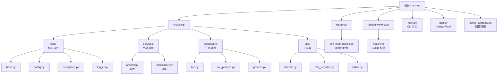

# Chaoxing 超星学习通自动化项目

## 变更记录 (Changelog)

- **2026-03-11 23:22:00**: 重构包结构，细分为 core/services/processors/utils 子包
- **2026-03-11 23:17:00**: 重构为 flat layout，使用 `chaoxing.xxx` 导入方式
- **2026-03-11 23:07:09**: 完成完整架构扫描，生成模块文档和索引文件

---

## 项目愿景

本项目旨在通过开源方式消灭付费刷课平台，为超星学习通/超星尔雅/泛雅超星平台提供全自动无人值守的任务点完成功能。项目遵循 GPL-3.0 协议，仅用于学习讨论，禁止用于盈利。

核心功能：
- 自动登录（支持账号密码和 Cookie 两种方式）
- 自动完成视频、音频、文档、阅读、直播、章节检测等任务点
- 支持多题库接口（言溪题库、LIKE知识库、TikuAdapter、AI大模型等）
- 支持多种外部通知服务（Server酱、Qmsg、Bark、Telegram）
- 支持 Docker 部署和 PyInstaller 打包

---

## 架构总览

这是一个基于 Python 3.13+ 的命令行应用程序，采用 flat layout 包结构：

- **入口层**: `main.py` 提供 CLI 入口，`app.py` 提供 Celery + Flask 集成（可选）
- **核心层**: `chaoxing/` 包封装所有与超星平台交互的逻辑
- **配置层**: 支持 INI 配置文件和命令行参数两种配置方式
- **并发层**: 使用 `ThreadPoolExecutor` 和 `PriorityQueue` 实现多章节并发处理

技术栈：
- HTTP 客户端: `requests` + `httpx`
- 并发控制: `threading` + `concurrent.futures`
- 日志: `loguru`
- 进度显示: `tqdm`
- 加密: `pyaes` (AES)
- 解析: `beautifulsoup4` + `lxml`
- AI 集成: `openai` SDK
- 字体解析: `fonttools`

---

## 模块结构图



---

## 模块索引

| 模块路径 | 职责 | 入口文件 | 说明 |
|---------|------|---------|------|
| `chaoxing/core/` | 核心 API 和基础设施 | `base.py`, `config.py` | Chaoxing 类、配置、异常、日志 |
| `chaoxing/services/` | 外部服务集成 | `answer.py`, `notification.py` | 题库服务、通知服务 |
| `chaoxing/processors/` | 任务处理器 | `live.py`, `process.py` | 直播任务、进度显示 |
| `chaoxing/utils/` | 工具类 | `decode.py`, `cipher.py` | 数据解析、加密、字体解码等 |
| `resource/` | 资源文件 | - | 存储字体映射表等静态资源 |
| `.github/workflows/` | CI/CD | `main.yml` | GitHub Actions 自动构建 Windows 可执行文件 |

---

## 运行与开发

### 环境要求
- Python 3.13+
- 依赖包见 `requirements.txt`

### 快速启动

**方式 1: 直接运行（交互式）**
```bash
python main.py
```

**方式 2: 配置文件运行**
```bash
cp config_template.ini config.ini
# 编辑 config.ini 填写账号密码
python main.py -c config.ini
```

**方式 3: 命令行参数**
```bash
python main.py -u 手机号 -p 密码 -l 课程ID1,课程ID2 -s 1.5 -j 4 -a retry
```

**方式 4: Docker 运行**
```bash
docker build -t chaoxing .
docker run -it -v /本地路径/config.ini:/config/config.ini chaoxing
```

**方式 5: uv 运行（推荐低版本 Python 用户）**
```bash
uv run --python 3.13 main.py -c config.ini
```

### 命令行参数

| 参数 | 说明 | 默认值 |
|-----|------|--------|
| `-c, --config` | 配置文件路径 | None |
| `-u, --username` | 手机号账号 | None |
| `-p, --password` | 登录密码 | None |
| `-l, --list` | 课程ID列表（逗号分隔） | None |
| `-s, --speed` | 视频播放倍速 | 1.0 |
| `-j, --jobs` | 同时进行的章节数 | 4 |
| `-a, --notopen-action` | 关闭任务点处理方式 | retry |
| `-v, --verbose` | 启用调试模式 | False |
| `--use-cookies` | 使用 cookies 登录 | False |

### 开发环境搭建

```bash
# 克隆项目
git clone --depth=1 https://github.com/Samueli924/chaoxing
cd chaoxing

# 安装依赖
pip install -r requirements.txt
# 或
pip install .

# 运行
python main.py
```

### 构建可执行文件

```bash
pip install pyinstaller
pyinstaller -F main.py -n 'chaoxing' --add-data "resource;resource" --hidden-import=chardet
```

---

## 测试策略

当前项目未包含自动化测试套件。建议的测试方式：

1. **手动功能测试**: 使用测试账号验证各类任务点处理
2. **配置测试**: 验证不同配置组合的正确性
3. **题库测试**: 验证各题库接口的连通性和答题准确性
4. **并发测试**: 验证多章节并发处理的稳定性

---

## 编码规范

- **Python 版本**: 3.13+
- **代码风格**: 遵循 PEP 8
- **类型注解**: 使用 Python 3.10+ 的类型注解语法（如 `dict[str, Any]`）
- **字符编码**: UTF-8，文件头包含 `# -*- coding: utf-8 -*-`
- **异常处理**: 使用自定义异常类（见 `api/exceptions.py`）
- **日志**: 统一使用 `loguru` 记录日志
- **并发**: 使用 `threading` 和 `ThreadPoolExecutor`，注意线程安全

### 关键设计模式

1. **单例模式**: `SessionManager` 确保全局唯一的 HTTP 会话
2. **工厂模式**: `Tiku.get_tiku_from_config()` 根据配置创建题库实例
3. **策略模式**: 不同任务类型（视频、文档、测验等）使用不同处理策略
4. **生产者-消费者**: `JobProcessor` 使用 `PriorityQueue` 管理章节任务

---

## AI 使用指引

### 项目结构理解

- **入口**: 从 `main.py` 的 `main()` 函数开始
- **核心类**: `chaoxing/base.py` 中的 `Chaoxing` 类是核心 API 封装
- **任务处理**: `main.py` 中的 `process_job()` 和 `process_chapter()` 处理具体任务
- **题库集成**: `chaoxing/answer.py` 中的 `Tiku` 及其子类实现题库接口

### 常见修改场景

**添加新题库支持**:
1. 在 `chaoxing/answer.py` 中继承 `Tiku` 类
2. 实现 `init_tiku()` 和 `query()` 方法
3. 在 `config_template.ini` 中添加配置说明

**添加新任务类型**:
1. 在 `main.py` 的 `process_job()` 中添加新的 `elif` 分支
2. 在 `chaoxing/base.py` 的 `Chaoxing` 类中添加对应的处理方法

**修改并发策略**:
1. 调整 `main.py` 中 `JobProcessor` 的 `worker_num` 参数
2. 修改 `process_chapter()` 中的 `ThreadPoolExecutor` 的 `max_workers`

### 调试技巧

- 使用 `-v` 参数启用 DEBUG 级别日志
- 检查 `chaoxing.log` 文件（如果配置了日志输出）
- 使用 `SessionManager._session.verify=False` 禁用 SSL 验证（仅调试用）
- 查看 `cache.json` 了解题库缓存状态

### 注意事项

- 本项目涉及自动化操作教育平台，请仅用于学习研究
- 修改代码时注意遵守 GPL-3.0 协议
- 不要在公开渠道分享包含个人账号信息的配置文件
- 题库 API 可能有调用频率限制，注意配置 `delay` 参数

---

## 配置说明

### 通用配置 [common]

- `use_cookies`: 是否使用 Cookie 登录（true/false）
- `username`: 手机号账号
- `password`: 登录密码
- `course_list`: 课程ID列表（逗号分隔，留空则学习所有课程）
- `speed`: 视频播放倍速（1.0-2.0）
- `jobs`: 同时进行的章节数（默认4）
- `notopen_action`: 关闭任务点处理方式（retry/ask/continue）

### 题库配置 [tiku]

- `provider`: 题库提供商（TikuYanxi/TikuLike/TikuAdapter/AI/SiliconFlow）
- `submit`: 是否自动提交答题（true/false）
- `cover_rate`: 最低题库覆盖率（0.0-1.0）
- `delay`: 查询间隔时间（秒）
- `tokens`: 题库 API Token
- 各题库专属配置见 `config_template.ini`

### 通知配置 [notification]

- `provider`: 通知服务提供商（ServerChan/Qmsg/Bark/Telegram）
- `url`: 通知服务 URL
- `tg_chat_id`: Telegram Chat ID（仅 Telegram 需要）

---

## 许可证

本项目遵循 [GPL-3.0 License](LICENSE) 协议：
- 允许开源/免费使用和引用/修改/衍生代码的开源/免费使用
- 不允许修改和衍生的代码作为闭源的商业软件发布和销售
- 禁止使用本代码盈利
- 基于本代码的程序必须同样遵守 GPL-3.0 协议

---

## 免责声明

- 本代码仅用于学习讨论，禁止用于盈利
- 他人或组织使用本代码进行的任何违法行为与本人无关
